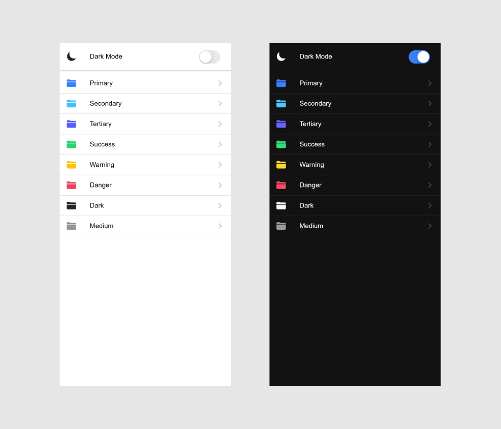

# Ionic Angular Dark Mode Toggle

I'll demonstrate how to manually switch between light and dark mode in your ionic application.

## Getting started

- [Download the installer](https://nodejs.org/) for Node LTS.
- Install the Ionic CLI globally `npm install -g @ionic/cli`
- Clone this repository `git clone https://github.com/bhuvaneshcj/IonicAngularDarkModeToggle.git`.
- Run `npm install` from the project root.
- Run `ionic serve` in a terminal from the project root.

## Screenshot

